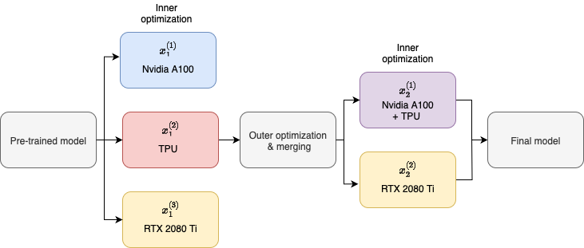

# AdLoCo: adaptive batching significantly improves communications efficiency and convergence for Large Language Models



## Abstract

Scaling distributed training of Large Language Models (LLMs) requires not only algorithmic advances but also efficient utilization of heterogeneous hardware resources. While existing methods such as DiLoCo have demonstrated promising results, they often fail to fully exploit computational clusters under dynamic workloads. To address this limitation, we propose a three-stage method that combines Multi-Instance Training (MIT), Adaptive Batched DiLoCo, and switch mode mechanism. MIT allows individual nodes to run multiple lightweight training streams with different model instances in parallel and merge them to combine knowledge, increasing throughput and reducing idle time. Adaptive Batched DiLoCo dynamically adjusts local batch sizes to balance computation and communication, substantially lowering synchronization delays. Switch mode further stabilizes training by seamlessly introducing gradient accumulation once adaptive batch sizes grow beyond hardware-friendly limits. Together, these innovations improve both convergence speed and system efficiency. We also provide a theoretical estimate of the number of communications required for the full convergence of a model trained using our method.

## Repo structure

```
multi-instance-training-main/
├── algorithms/                # Core algorithm implementations
│   ├── calc_batch.py          # Batch calculation logic
│   ├── policies.py            # Policy management and strategies
│   ├── switch_mode.py         # Switching between training modes
│
├── assets/                    # Project diagrams and visual assets
│   ├── diagram3.drawio.png
│   ├── diagram4.drawio.png
│
├── fabrics/                   # Dataset, evaluation, and model utilities
│   ├── dataset_loader.py      # Data loading utilities
│   ├── eval_tool.py           # Evaluation tools
│   ├── models.py              # Model architectures
│
├── gradient_analysis/         # Gradient analysis tools
│   ├── config_analyze_gradient.yaml  # Config file for gradient analysis
│   ├── gradient_analysis.py   # Gradient analysis script
│
├── training_logs/             # Logging and monitoring tools
│   ├── log_processor.py       # Log parsing and processing
│   ├── memory_monitor.py      # GPU/CPU memory usage monitor
│   ├── step_loss_logger.py    # Step-wise loss logging
│   ├── training_monitoring.py # Training monitoring utilities
│
├── utils/                     # General utility functions
│   ├── max_batch_calculator.py # Calculate max feasible batch size
│   ├── utils.py                # Helper utilities
│
├── с4/                        # C4 dataset processing
│   ├── guide.md               # Guide for using C4
│   ├── tokenize_c4.py         # Tokenization script for C4 dataset
│
├── .gitignore                 # Git ignore rules
├── README.md                  # Project documentation
├── cluster.py                 # Cluster initialization script
├── config.yaml                # Main configuration file
├── requirements.txt           # Python dependencies
├── run.py                     # Entry point for training
├── trainers.py                # Training loop and trainers
```

## Config
```yaml
# --- DEVICES AND SEED ---
training_seed: 42             # Random seed
CUDA_VISIBLE_DEVICES: "1,3"   # GPUs for CUDA_VISIBLE_DEVICES
devices: ["cuda:1"]           # GPUs used for training
real_device_ids: ['4']

# --- LOGS ---
log_dir: "logs"                     # Main log directory
log_file: "training_log.log"        # File where all logs are stored
memory_report_dir: "memory_report"  # Directory for memory usage reports
model_training_report_dir: "model_training_report" # Directory for training reports
model_weights_dir: "model_weights"  # Directory for model weights

# --- DATASET ---
dataset: "c4"       # Dataset name
# Supported datasets:
# - "imdb" - for BERT model (text classification)
# - "c4" - for MicroLlama (language modeling)
data_sample_size: 2048

# --- MODELS ---
model_type: 'microllama'          # Model name
model_config: {"name": "keeeeenw/MicroLlama"} # Model config parameters
# Recommended combinations:
# - BERT + IMDB: model_type: 'bert', dataset: "imdb"
# - MicroLlama + C4: model_type: 'microllama', dataset: "c4"

# --- TRAIN SETTINGS ---
number_of_training_epochs: 2             # Number of epochs
learning_rate_for_inner_opt: 1e-5        # lr for inner optimizer (inner_step)
learning_rate_for_outer_opt: 1e-4        # lr for outer optimizer (outer_step)
nodes_per_gpu: 4                         # Number of nodes per GPU
number_of_initial_trainers: 4            # Number of trainers
number_of_inner_steps_between_outers: 5  # Number of inner steps before synchronization
INITIAL_BATCH_SIZE: 3                    # Initial batch size
ETA: 0.1                                 # Eta parameter from the paper
vartheta: 0.01                           # Vartheta parameter from the paper (still unclear how to choose)
nu: 0.15                                 # Nu parameter from the paper
sampling_method: "norm_test"             # Adaptive Sampling method: "norm_test", "augmented_inner_product_test", or "none"
distributed_algo: "LocalSGD"             # Distributed training algorithm: "LocalSGD" or "DiLoCo"
padding_percentage: 0.85                 # Padding percentage for maximum batch size
```

## Logs

When the code is run, a `logs` folder is created. Inside it, a subfolder for the current training session is generated in the format:
`
Model_Dataset_Date
`

Inside this folder, separate subfolders are created to store training plots, memory plots, and model weights. A log file (name specified in the config) is also created here.


## Running the experiments

```bash
pip install -r requirements.txt
````

After installing all dependencies you need to initialise ClearML to view the training logs properly:

```bash
clearml-init
```

Than you can start the training procdeure

```bash
python3.8 run.py
```

## Test if the dataset was loaded correctly

To verify correct dataset handling, run the test script:

```bash
python3.8 test_c4_dataset.py
```

This script checks:
- Loading and processing of the C4 dataset
- Correct text tokenization
- Functionality of perplexity metric for model evaluation


## Using the C4 Dataset

The C4 (Colossal Clean Crawled Corpus) dataset is intended for training language models. To use it:

1.	Set the following in config.yaml:
```yaml
dataset: "c4"
model_type: 'microllama'
model_config: {"name": "keeeeenw/MicroLlama"}
```

2. Start training:
```bash
python3.8 run.py
```

## Optimizations for C4:
- By default, streaming mode is used for efficient loading
- Only required data is loaded (no full dataset caching)
- Progress is displayed every 500 samples

Recommendations:
- For experiments, set data_sample_size: 1000-5000
- For full training, increase to data_sample_size: 50000+
- The system will automatically switch to a fallback dataset in case of errors

Note: C4 is a very large dataset (~750GB). Optimized loading is critical for efficient resource usage.

## Full Gradient Variance Calculation

This script computes the full gradient of the trained model across the entire dataset, as well as gradients for each batch. It then analyzes deviations of batch gradients from the full gradient and generates a histogram of these deviations, saving it to a file.

To run, edit `config_analyze_gradient.yaml`, then execute:

```bash
python3.8 analyze_gradients.py
```

## Errors

In case of cryptography errors:
```
ImportError: /home/user/miniconda3/envs/opt1/lib/python3.8/site-packages/_cffi_backend.cpython-38-x86_64-linux-gnu.so: undefined symbol: ffi_type_uint32, version LIBFFI_BASE_7.0
thread '<unnamed>' panicked at 'Python API call failed', /croot/cryptography_1702070282333/_build_env/.cargo.Linux/registry/src/index.crates.io-6f17d22bba15001f/pyo3-0.18.3/src/err/mod.rs:790:5
note: run with RUST_BACKTRACE=1 environment variable to display a backtrace
```
try to reinstall the package, it should help:
```
python3 -m pip install cffi --force-reinstall
```


## References

[1] Raghu Bollapragada, Richard Byrd, and Jorge Nocedal. Adaptive sampling strategies for stochastic
optimization, 2017. URL https://arxiv.org/abs/1710.11258.

[2] Richard H. Byrd, Gillian M. Chin, Jorge Nocedal, and Yuchen Wu. Sample size selection in opti-
mization methods for machine learning. Math. Program., 134(1):127–155, August 2012. ISSN
0025-5610.

[3] Arthur Douillard, Qixuan Feng, Andrei A. Rusu, Rachita Chhaparia, Yani Donchev, Adhiguna
Kuncoro, Marc’Aurelio Ranzato, Arthur Szlam, and Jiajun Shen. Diloco: Distributed low-
communication training of language models, 2024. URL https://arxiv.org/abs/2311.
08105.

[4] John Duchi, Elad Hazan, and Yoram Singer. Adaptive subgradient methods for online learning and
stochastic optimization. Journal of Machine Learning Research, 12:2121–2159, 07 2011.

[5] Tim Tsz-Kit Lau, Han Liu, and Mladen Kolar. Adadagrad: Adaptive batch size schemes for adaptive
gradient methods, 2024. URL https://arxiv.org/abs/2402.11215.

[6] Sebastian U. Stich. Local sgd converges fast and communicates little, 2019. URL https://
arxiv.org/abs/1805.09767.

[7] Zixiao Ken Wang. Microllama: A 300m-parameter language model trained from
scratch. https://github.com/keeeeenw/MicroLlama, https://huggingface.
co/keeeeenw/MicroLlama, 2024. GitHub and Hugging Face repositories.

